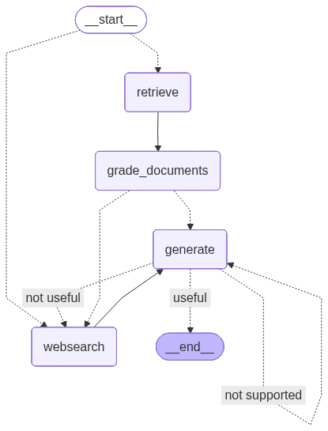

# Agentic RAG - Self-Reflective Retrieval-Augmented Generation

## Overview

Agentic RAG is a **Self-Reflective Retrieval-Augmented Generation (Self-RAG)** system that intelligently retrieves, evaluates, and generates answers with minimal hallucinations. The system uses a graph-based workflow to determine document relevance, decide when to perform web searches, and generate accurate responses based on verified information.


## 🎯 Key Features

- **Intelligent Document Retrieval**: Fetches relevant documents from a ChromaDB vector database
- **Relevance Grading**: Uses an LLM to assess document relevance to the user's question
- **Adaptive Web Search**: Automatically performs web searches when retrieved documents are insufficient
- **Hallucination Prevention**: Only generates answers based on verified, relevant documents
- **Graph-Based Workflow**: Orchestrates complex multi-step processes using LangGraph
- **Structured Output**: Uses Pydantic models for reliable LLM outputs

## 🏗️ Architecture

### Workflow Steps

```
User Question
    ↓
[1] RETRIEVE - Fetch documents from vector database
    ↓
[2] GRADE_DOCUMENTS - Evaluate document relevance
    ↓
    ├─→ All relevant? (NO) → [3] WEBSEARCH - Search the web
    │                            ↓
    └─→ All relevant? (YES) ────→ [4] GENERATE - Create answer
         ↓
    Final Response
```

### Components

#### 1. **Graph State** (`graph/state.py`)
Defines the data flow through the workflow:
- `question` (str): User's input question
- `documents` (List): Retrieved documents from the database
- `generation` (str): LLM-generated answer
- `web_search` (bool): Flag indicating if web search is needed

#### 2. **Graph Nodes** (`graph/nodes/`)

**Retrieve Node** (`retrieve.py`)
- Invokes the document retriever with the user's question
- Fetches relevant documents from ChromaDB

**Grade Documents Node** (`grade_documents.py`)
- Evaluates each retrieved document for relevance using the grading chain
- Filters out irrelevant documents
- Sets `web_search` flag if any document is deemed irrelevant

**Web Search Node** (`web_search.py`)
- Performs web searches using Tavily Search API
- Augments retrieved documents with web results
- Provides fallback information when local documents are insufficient

**Generate Node** (`generation.py`)
- Generates a comprehensive answer using an LLM
- Combines the question with relevant context
- Produces hallucination-resistant responses

#### 3. **Chains** (`graph/chains/`)

**Retrieval Grader** (`retrieval_grader.py`)
- Uses an LLM to evaluate document relevance
- Returns binary scores (yes/no) for relevance
- Prevents irrelevant information from being used in generation

#### 4. **Main Workflow** (`graph/graph.py`)
- Constructs the LangGraph workflow
- Defines node connections and conditional routing
- Visualizes the workflow as a Mermaid diagram

## 🚀 Getting Started

### Prerequisites

- Python 3.14+
- OpenAI API key
- Tavily Search API key (for web search functionality)

### Installation

1. **Clone the repository**
```bash
git clone <repository-url>
cd agentic-rag
```

2. **Install dependencies**
```bash
pip install -r requirements.txt
# or using the pyproject.toml
pip install .
```

3. **Set up environment variables**
```bash
# Create a .env file
cat > .env << EOF
OPENAI_API_KEY=your_openai_api_key_here
TAVILY_API_KEY=your_tavily_api_key_here
EOF
```

### Dependencies

- **LangChain**: Core framework for LLM applications
- **LangGraph**: Graph-based workflow orchestration
- **OpenAI**: Large Language Models (GPT-3.5/GPT-4)
- **ChromaDB**: Vector database for document storage
- **Tavily**: Web search integration
- **Pydantic**: Data validation using Python type annotations
- **pytest**: Testing framework

## 💻 Usage

### Basic Usage

```python
from graph.graph import app

# Run the workflow
result = app.invoke(input={
    "question": "What is agent memory?"
})

print(result)
```

### Running the Main Application

```bash
python main.py
```

### Running Tests

```bash
# Run all tests
pytest graph/chains/tests/test_chains.py -v

# Run a specific test
pytest graph/chains/tests/test_chains.py::test_retrieval_grader_answer_yes -v
```

## 📊 Workflow Visualization

A visual representation of the workflow is generated as `graph.png`:

```bash
# The graph is automatically generated when running graph.py
python -m graph.graph
```

## 🧪 Testing

The project includes comprehensive tests:

**Test Files**: `graph/chains/tests/test_chains.py`

- `test_retrieval_grader_answer_yes`: Validates positive relevance grading
- `test_retrieval_grader_answer_no`: Validates negative relevance grading
- `test_generation_chain`: Tests the answer generation pipeline

## 🔧 Configuration

### Adjusting LLM Parameters

Edit `graph/nodes/generation.py` and `graph/chains/retrieval_grader.py`:

```python
llm = ChatOpenAI(
    temperature=0,        # 0 for deterministic, 1 for creative
    model_name="gpt-4",  # Change model as needed
)
```

### Changing Vector Database

Edit `ingestion.py` to use a different vector store:
- ChromaDB (default)
- Pinecone
- Weaviate
- FAISS
- And more...

### Web Search Configuration

Edit `graph/nodes/web_search.py`:

```python
web_search_tool = TavilySearch(max_results=3)  # Adjust result count
```

## 📁 Project Structure

```
agentic-rag/
├── main.py                 # Entry point
├── ingestion.py           # Document ingestion and retrieval setup
├── pyproject.toml         # Project dependencies
├── graph/
│   ├── __init__.py
│   ├── state.py           # GraphState schema
│   ├── consts.py          # Constants (node names)
│   ├── graph.py           # Main workflow definition
│   ├── chains/
│   │   ├── retrieval_grader.py    # Document relevance grader
│   │   └── tests/
│   │       └── test_chains.py     # Test suite
│   └── nodes/
│       ├── retrieve.py           # Document retrieval node
│       ├── grade_documents.py    # Document grading node
│       ├── web_search.py         # Web search node
│       └── generation.py         # Answer generation node
└── README.md
```

## 🎓 How It Works

### 1. Question Ingestion
User provides a question to the system.

### 2. Document Retrieval
The system queries the vector database for documents similar to the question.

### 3. Relevance Grading
Each retrieved document is graded by an LLM:
- **Relevant** (yes): Document contains information about the question
- **Irrelevant** (no): Document doesn't match the question

### 4. Conditional Routing
- **If all documents are relevant**: Skip web search, proceed to generation
- **If any document is irrelevant**: Perform web search for additional context

### 5. Generation
The LLM generates an answer using:
- The user's question
- All verified relevant documents
- Web search results (if performed)

### 6. Output
Return the generated answer to the user

## 🛡️ Hallucination Prevention

This system reduces hallucinations through:

1. **Document Grading**: Only uses documents explicitly deemed relevant
2. **Explicit Boundaries**: Limits LLM to provided context
3. **Web Search Fallback**: Fills gaps with real-time web information
4. **Structured Outputs**: Uses Pydantic models for reliable LLM responses

### Updated Workflow with Hallucination Prevention


## Adaptive RAG
1. **WebSearch Conditional Node**: Only performs web search if no relevant documents are found at the first step
2. **Conditional Entry Point**: `workflow.set_conditional_entry_point(path_map)`

### Updated Workflow with Adaptive RAG

## 🚦 Error Handling

The system handles common issues:

- **Missing documents**: Triggers web search
- **API failures**: Graceful fallbacks
- **Network issues**: Implemented retry logic for API calls

## 📝 Example Queries

```python
# Example queries the system can handle:
queries = [
    "What is agent memory?",
    "How does retrieval-augmented generation work?",
    "Explain the concept of self-reflection in RAG",
    "What are transformer models?",
]
```

## 🔄 Development Workflow

### Adding New Nodes

1. Create a new file in `graph/nodes/`
2. Define a function that takes `GraphState` and returns a dict
3. Add the node to `graph/graph.py`
4. Create tests in `graph/chains/tests/`

### Example New Node

```python
# graph/nodes/custom_node.py
from graph.state import GraphState
from typing import Dict, Any

def custom_node(state: GraphState) -> Dict[str, Any]:
    print("--- Custom Node ---")
    # Your logic here
    return state
```

## 📚 References

- [LangChain Documentation](https://python.langchain.com/)
- [LangGraph Documentation](https://python.langchain.com/docs/langgraph/)
- [Self-RAG Paper](https://arxiv.org/abs/2310.11511)
- [Retrieval-Augmented Generation](https://arxiv.org/abs/2005.11401)

## 🐛 Troubleshooting

### Common Issues

**Issue**: "ModuleNotFoundError: No module named 'graph'"
- **Solution**: Run with `python -m` from the project root

**Issue**: "OPENAI_API_KEY not found"
- **Solution**: Create a `.env` file with your API key

**Issue**: Web search not working
- **Solution**: Verify Tavily API key in `.env`

## 📄 License

[Your License Here]

## 👤 Author

Shivesh

---

**Built with ❤️ using LangChain, LangGraph, and OpenAI**
